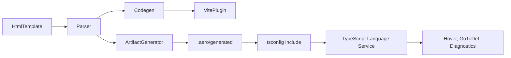

# Aero TS-First Support in .html Templates

## Goal

Enable TypeScript-first authoring in Aero `.html` templates for:

- `<script on:build>` and `<script on:client>` blocks
- `{ ... }` expressions in text, attributes, conditionals, and props

Deliver editor/LSP benefits: hover, jump-to-definition, and diagnostics (type checking) for script and expression content, while keeping Aero's runtime and build behavior unchanged.

## Scope (Aero-specific)

- **Framework**: [packages/core](packages/core) — parser, codegen, Vite plugin, runtime.
- **App**: [packages/start](packages/start) — tsconfig, sample pages; generated artifacts will live under the app (e.g. `.aero/generated`).
- **Editor**: [packages/vscode](packages/vscode) — will consume generated artifacts in the Go to Definition plan; this plan focuses on emitting and wiring the TS artifacts.

---

## Current State

- **Parser** ([packages/core/compiler/parser.ts](packages/core/compiler/parser.ts)): Extracts script `content` only; no `lang`/`type` metadata. [packages/core/types.ts](packages/core/types.ts) `ParseResult` has `buildScript: { content: string } | null` and `clientScript: { content: string } | null`.
- **Codegen** ([packages/core/compiler/codegen.ts](packages/core/compiler/codegen.ts)): Inlines script and compiles template to a single async render function; `{ }` expressions become `${expr}` in template literals. Build script runs in a scope that receives `aero` with `site`, `slots`, `renderComponent` ([packages/core/compiler/helpers.ts](packages/core/compiler/helpers.ts) `emitRenderFunction`).
- **Vite plugin** ([packages/core/vite/index.ts](packages/core/vite/index.ts)): Client scripts are stored under a virtual URL with `.js` suffix. Virtual module content is script text only; TS Server does not see it as TypeScript.
- **VS Code** ([packages/vscode](packages/vscode)): Grammar injects JS for `{ }` expressions; no TypeScript or generated-file integration.

---

## Architecture

- **ArtifactGenerator**: New component (build-time or in Vite plugin) that, for each Aero `.html` file, emits companion `.ts` files and optional source-map metadata. TS Server indexes these via tsconfig so the editor gets intellisense.
- **Runtime/build**: Unchanged; codegen and Vite continue to produce the same render modules and client script URLs.

---

## Phase 1: TypeScript-default compiler contract

**1.1 Parser and types**

- In [packages/core/types.ts](packages/core/types.ts), extend script shape to carry optional language hint, e.g. `buildScript: { content: string; lang?: 'ts' | 'js' } | null`. Do not change the runtime contract (codegen still only uses `content`).
- In [packages/core/compiler/parser.ts](packages/core/compiler/parser.ts), when extracting `<script on:build>` and `<script on:client>`, read `lang` and `type` from the script tag; normalize to TypeScript as default. Optionally reject explicit `lang="js"` or `type="text/javascript"` with a clear compile error so the project is TS-only.

**1.2 Vite plugin: client scripts as TS**

- In [packages/core/vite/index.ts](packages/core/vite/index.ts), where the client script virtual URL is built (e.g. `relativePath.replace(/\.html$/i, '.js')`), switch to `.ts` for the virtual module key/URL so that any consumer treats it as TypeScript. Ensure the `load` callback still returns the same script content; only the virtual ID/URL extension changes. Verify dev and build still work.

---

## Phase 2: Generated TS artifacts for editor intelligence

**2.1 Artifact layout and contents**

- **Location**: Emit under the app root (e.g. [packages/start](packages/start)), in a dedicated directory such as `.aero/generated/`. Document the convention.
- **Per-template files** (one set per source `.html` file, keyed by path relative to `src`):
  - **Build script companion**: e.g. `pages/home.build.ts` — same code as `<script on:build>`, wrapped in a typed scope with globals from `aero` (`site`, `slots`, `renderComponent`). Use an ambient declaration or stub so `aero` and `site` resolve for the TS program.
  - **Client script companion**: e.g. `pages/home.client.ts` — same content as `<script on:client>` (module-level).
  - **Expressions companion**: e.g. `pages/home.expr.ts` — synthetic file with all `{ ... }` expressions in small typed scopes exposing the same globals, so TS can check and provide hover/definition for expression identifiers. Reuse or mirror the logic that finds `{ ... }` in codegen/helpers.
- **Source mapping**: Persist mapping metadata (e.g. JSON) from generated file + offset to source HTML file + offset for diagnostics and definition mapping in the extension.

**2.2 Generation trigger**

- **Option A (recommended)**: Generate artifacts inside the Vite plugin when processing an `.html` file. On `transform`/`load`, after parsing, write companion `.ts` files and mapping JSON to `.aero/generated/`. Ensure deterministic writes and avoid redundant work.
- **Option B**: Separate CLI or build step that discovers all Aero `.html` files and generates artifacts.

**2.3 Tsconfig and types**

- In the app's tsconfig (e.g. [packages/start/tsconfig.json](packages/start/tsconfig.json)), add the generated directory to `include` (e.g. `".aero/generated/**/*.ts"`). Use `rootDir`/`rootDirs` if needed so path aliases (`@content/*`, `@components/*`) still resolve.
- Provide a small `.d.ts` (in core or app) that declares the build-script/expression context type (`aero`, `site` from content). Generated build/expr companions reference this.

---

## Phase 3: Editor integration (minimal)

- Generated files are on disk and in tsconfig, so the TypeScript extension and TS Server will index them. No change required in [packages/vscode](packages/vscode) in this plan.
- **HTML → generated mapping**: To show hover/definition/diagnostics *inside* the HTML, the Go to Definition plan (which assumes these artifacts exist) will map the user's position in the HTML to the generated TS and call TS Server or re-expose results with translated ranges.

---

## Phase 4: Tests and validation

- **Parser**: Add cases for default TS behavior and optional rejection of explicit JS script tags.
- **Vite plugin**: Assert client script virtual IDs use `.ts` and that artifact generation produces expected files when transforming an HTML file.
- **Codegen**: No behavioral change; existing tests pass. Optionally test expression extraction for the artifact generator.
- **Manual**: In packages/start, run dev, edit an Aero page; confirm `.aero/generated` is populated and that opening a generated `.build.ts` or `.expr.ts` gives TypeScript intellisense for `site` and imports.

---

## Risks and constraints

- **Nested braces**: Current `{ }` extraction is regex-based; document limitations or harden parsing for expression companions.
- **Performance**: Generate only when source HTML changes; consider caching by content hash.
- **Single source of truth**: Generated files are derived; add a comment in each that they are auto-generated and list the source HTML path.

---

## Summary checklist

| Item                   | Description                                                       |
| ---------------------- | ----------------------------------------------------------------- |
| Parser script metadata | Optional `lang` in ParseResult; default and optionally enforce TS |
| Vite client virtual ID | Use `.ts` for client script virtual URL/key                       |
| Artifact generator     | Emit .build.ts, .client.ts, .expr.ts (and mapping) per HTML file  |
| Artifact location      | `.aero/generated/` under app root                                 |
| Tsconfig               | Include generated dir; ambient Aero context types                 |
| Tests                  | Parser, Vite plugin, optional expression extraction               |
| Docs                   | Document artifact layout; Go to Definition plan consumes them     |

This plan does not implement "Go to Definition from inside the HTML file"; it provides the TS-first contract and generated TS artifacts so the revised Go to Definition plan can assume TS support and delegate symbol-level definition to TypeScript where appropriate.