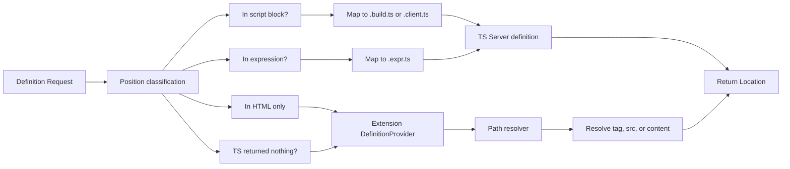

# VS Code Go-to-Definition for Aero HTML (Assuming TS Support)

## Prerequisite

**[Aero TS-First Support](.cursor/plans/aero-ts-first-support.plan.md)** is implemented. That means:

- Each Aero `.html` file has generated companion TS under `.aero/generated/` (e.g. `pages/home.build.ts`, `pages/home.client.ts`, `pages/home.expr.ts`).
- Tsconfig includes the generated directory; TypeScript language service indexes these files.
- Mapping metadata exists from generated file + offset to source HTML file + offset (for script blocks and expressions).

This plan implements Go to Definition **from inside the HTML file**, using that TS infrastructure and the extension together.

---

## Goal

Enable Option+click (Go to Definition) from within Aero `.html` files for every reference type:

| Reference             | Example                            | Who handles                            | Target                                          |
| --------------------- | ---------------------------------- | -------------------------------------- | ----------------------------------------------- |
| Import path string    | `'@components/meta'` in script     | Extension or TS                        | Resolved file (e.g. meta.html)                  |
| Imported symbol       | `meta` in script                   | **TypeScript**                         | Symbol in resolved module (e.g. default export) |
| Script/link src/href  | `src="@scripts/index.ts"`          | **Extension**                          | Resolved asset file                             |
| Component/layout tag  | `<nav-component>`, `<base-layout>` | **Extension**                          | nav.html, base.html                             |
| Expression identifier | `site`, `site.meta.title` in `{ }` | **TypeScript** (or extension fallback) | Content file or property in site.ts             |

**Division of labor**: TypeScript provides **symbol-level** definition when the cursor is in a script block or inside a `{ }` expression (using the generated companion files and position mapping). The extension provides **file-level** definition for HTML-only references (component tags, script/link `src`/`href`) and, when TS does not apply, for import path strings and content globals.

---

## Considerations (TS support already in place)

**1. Delegation order**  
When the user triggers Go to Definition in an HTML document:

- **If position is inside `<script on:build>` or `<script on:client>**`: Map the position to the corresponding generated `.build.ts` or `.client.ts`; call the TypeScript language service’s definition API for that virtual/generated file at the mapped offset. Return the definition location(s), translating back to the HTML document if desired (or leave as the generated/source file).
- **If position is inside a `{ ... }` expression**: Map to the generated `.expr.ts` and call TS definition at the mapped offset. Return TS result (possibly translated to content file, e.g. site.ts).
- **Otherwise** (cursor on component tag, script `src`, or we couldn’t map to TS): Use the extension’s DefinitionProvider to resolve path/tag/content and return file-level `Location`.

**2. Avoiding duplicate or conflicting results**  
VS Code can show multiple definition locations. Prefer a single source per request: either TS or extension, not both for the same click. Use position classification (in script? in expression? in tag? in attribute?) to decide which to call. If TS returns no result (e.g. cursor on the path string only), fall back to the extension’s path resolution.

**3. Position mapping (HTML → generated TS)**  
The TS-first plan produces mapping metadata (generated offset → source HTML offset). The extension needs the inverse or a lookup: given (HTML file, offset), find (generated file, offset) when the offset lies in a script block or expression. Implement or consume a small helper that uses the mapping JSON; if the cursor is not in a mapped region, do not call TS.

**4. Path strings in script**  
Clicking on the **path** in `import meta from '@components/meta'` can be handled by either (a) TypeScript’s “Go to Definition” on the module specifier (if the TS Server exposes it for the generated file), or (b) the extension’s path resolver. If TS already returns the resolved file for the specifier, rely on that; otherwise the extension’s DefinitionProvider can handle it when the cursor is inside the string and TS returns nothing.

**5. Content globals in expressions**  
For `{ site.meta.title }`, TS (via the expression companion) can resolve `site` to `@content/site` and provide definition to the content file or property. If the expression companion is typed with `site` from content, TS may already give symbol-level definition. The extension only needs to handle expression positions when mapping or TS is unavailable (e.g. file-level fallback to `src/content/site.ts`).

---

## Architecture

- **Position classification**: Determine if the cursor is inside a script block, inside a `{ }` expression, or elsewhere (tag name, attribute value, etc.).
- **TS path**: Use mapping metadata to get (generated file, offset); call TS Server’s definition; return and optionally translate locations back to HTML.
- **Extension path**: Path resolver (tsconfig-based) + logic for component tags, script/link `src`/`href`, and content global file-level. Same as in the original plan, but only for HTML-only or fallback cases.

---

## 1. Extension setup

- **Entry point**: Add `main` (e.g. `./out/extension.js`) and `activationEvents` (e.g. `onLanguage:html`) in [packages/vscode/package.json](packages/vscode/package.json).
- **Build**: Compile TypeScript to `out/` (or `dist/`); ensure the extension runs against the workspace that contains the Aero app (e.g. packages/start).
- **Grammar**: Point the grammar contribution to the existing expressions grammar ([packages/vscode/syntaxes/expressions.json](packages/vscode/syntaxes/expressions.json)).

---

## 2. Path resolution (shared)

- **Root**: For the active document, resolve project root (directory with tsconfig that covers the file, or workspace folder).
- **Aliases**: Load `compilerOptions.paths` and `baseUrl` from that tsconfig; implement `resolvePath(specifier)` matching [packages/core/utils/aliases.ts](packages/core/utils/aliases.ts). For specifiers without extension (e.g. `@components/meta`), append `.html` when resolving.
- Used for: script/link `src`/`href`, component/layout tag → file, content global → content file, and (when TS does not handle it) import path string.

---

## 3. HTML → generated TS position mapping

- **Input**: HTML document URI and offset (or position).
- **Output**: Generated file path (e.g. `.aero/generated/pages/home.build.ts`) and offset in that file, or “not in a mapped region.”
- **Implementation**: Read the mapping metadata produced by the TS-first plan (per-HTML-file JSON or equivalent). Build a reverse map or search: for the current HTML offset, determine if it falls in a script block or expression range and get the corresponding generated file and offset. If the TS-first plan stores (sourceRange, generatedRange), use sourceRange to see if the cursor is inside and then use generatedRange for the TS call.

---

## 4. DefinitionProvider implementation

Register a `DefinitionProvider` for `html`. In `provideDefinition(document, position, token)`:

**4.1 Try TypeScript first (script and expression regions)**

- Run position classification: is `position` inside a `<script on:build>`, `<script on:client>`, or inside a `{ ... }` expression?
- If yes, use the HTML→generated mapping to get (generatedFile, generatedOffset). Call the TypeScript language service (e.g. via `vscode.commands.executeCommand('vscode.executeDefinitionProvider', ...)` with the generated file URI and position, or use the TS API if the extension has access). If a definition is returned, translate the result back to the user-visible file if desired (e.g. show definition in the real source like site.ts, not in .expr.ts), then return it.
- If TS returns no definition (e.g. cursor on the module specifier string) and the cursor is on an import path string, fall through to extension path resolution.

**4.2 Extension-handled cases (HTML-only or fallback)**

- **Script/link `src` and `href**`: Cursor in attribute value → resolve with same rules as [packages/core/vite/build.ts](packages/core/vite/build.ts) `resolveTemplateAssetPath`; return `Location` to resolved file.
- **Component/layout tag**: Cursor on tag name matching `-(component|layout)` → resolve to `@components/<base>.html` or `@layouts/<base>.html`; return `Location` to that file.
- **Content global in expression**: If cursor is in `{ }` but TS did not return a definition (e.g. mapping missing or TS doesn’t resolve it), and the identifier under cursor is a known global (e.g. `site`), resolve to content file (e.g. `@content/site` → `src/content/site.ts`) and return file-level `Location`.
- **Import path string**: If cursor is inside the specifier string of an `import` and TS did not return a definition, resolve the specifier with `resolvePath` (and `.html` fallback); return `Location` to the resolved file.

---

## 5. File structure (packages/vscode)

- `src/extension.ts` – activate, register DefinitionProvider for `html`.
- `src/definitionProvider.ts` – implements `provideDefinition`; coordinates TS delegation and extension resolution.
- `src/positionAt.ts` – position classification (in script? in expression? tag name? attribute value? import specifier?).
- `src/htmlToGeneratedMapping.ts` – reads mapping metadata; given (HTML uri, offset), returns (generated file uri, offset) or null.
- `src/pathResolver.ts` – tsconfig-based path resolution (unchanged from original plan).
- `src/constants.ts` – component/layout suffix regex, content global → alias map.

---

## 6. Edge cases

- **Generated files not yet written**: If the HTML was just opened or artifacts are stale, mapping may be missing. Fall back to extension-only behavior (file-level for path, tag, content).
- **Multiple workspace folders**: Resolve root and tsconfig per document.
- **TS returns definition in generated file**: Prefer returning the location in the real source (e.g. site.ts) when the definition is in a content file or component; the mapping or TS result may already point there. If the result is in a generated file, returning it is still valid (user can see the definition); optionally add a second “original source” location if available.

---

## 7. Testing and docs

- **Manual**: In packages/start (with TS-first artifacts generated), Option+click in script (symbol and path), in expression (`site`, `site.meta.title`), on component tag, on script `src`; confirm correct targets and no duplicate/confusing results.
- **Docs**: Update [packages/vscode/README.md](packages/vscode/README.md) to describe Go to Definition behavior and dependency on generated TS artifacts.

---

## Summary checklist

| Item               | Description                                                                  |
| ------------------ | ---------------------------------------------------------------------------- |
| Prerequisite       | TS-first plan implemented; `.aero/generated` and mapping exist               |
| Extension setup    | main, activationEvents, build, grammar path                                  |
| Path resolver      | tsconfig discovery, resolvePath, .html fallback                              |
| Position mapping   | HTML (uri, offset) → (generated file, offset) for script/expression          |
| TS delegation      | Call TS definition when position is in script or expression; use mapping     |
| DefinitionProvider | Register for html; try TS first, then extension for tags, src, content, path |
| Avoid duplicates   | Single source per request (TS or extension) by position classification       |
| Fallback           | When TS returns nothing (e.g. path string), use extension path resolution    |
| Tests and docs     | Manual verification; README update                                           |

This plan assumes TS support is in place and focuses the extension on wiring definition requests to TypeScript where possible and on handling all HTML-only references cleanly.